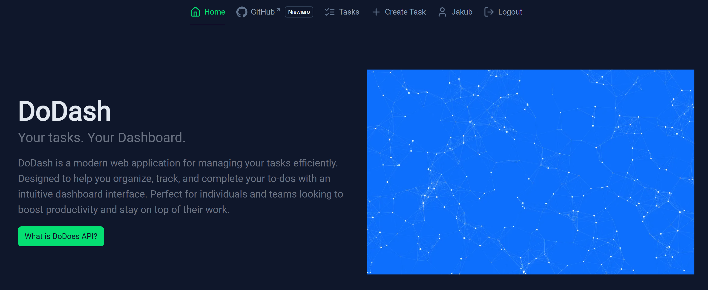
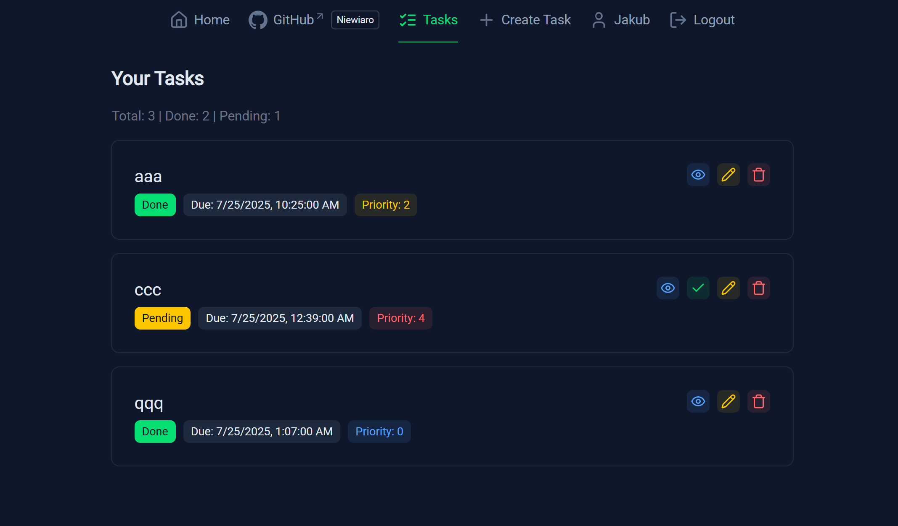

<a id="readme-top"></a>

# 📋 DoDash – Task Manager Frontend (Nuxt 4)

[![Contributors][contributors-shield]][contributors-url]
[![Forks][forks-shield]][forks-url]
[![Stargazers][stars-shield]][stars-url]
[![Issues][issues-shield]][issues-url]
[![Apache 2.0 License][license-shield]][license-url]

> **DoDash** is a modern Nuxt 4 app for managing personal tasks.  
> Built with composables, Vue 3, Tailwind, and Nuxt UI — fully dockerized and integrated with [DoDoes API](https://github.com/Niewiaro/dodoes).

---

## 📚 Table of Contents

1. [Installation](#installation)
2. [Environment Configuration](#environment-configuration)
3. [Project Features](#project-features)
4. [Docker Usage](#docker-usage)
5. [GitHub Pages Deployment](#github-pages-deployment)
6. [Screenshots](#screenshots)

---

## ⚙️ Installation <a name="installation"></a>

### 🐳 Docker

```bash
docker compose up --build
````

App will be available at:
🔗 [http://localhost:3000](http://localhost:3000)

✅ Make sure the backend API is running at [http://localhost:8000](http://localhost:8000) or another host.

<p align="right">(<a href="#readme-top">back to top</a>)</p>

---

## 🔐 Environment Configuration <a name="environment-configuration"></a>

Create a `.env` file in the project root:

```env
NUXT_PUBLIC_API_BASE_URL=http://host.docker.internal:8000
HOST=0.0.0.0
PORT=80
NODE_ENV=production
```

✅ `host.docker.internal` works cross-platform (WSL, Linux, macOS, Windows).

> You can override these via `docker-compose.yml` or `.env.docker`.

<p align="right">(<a href="#readme-top">back to top</a>)</p>

---

## ✨ Project Features <a name="project-features"></a>

* ✅ Nuxt 4 + Vue 3 + TypeScript
* 🔐 JWT-based auth
* 🧠 Task CRUD: Create / Edit / Complete / Delete
* 🖥️ Nuxt UI + Tailwind styling
* 💡 SSR support
* 🔁 Integrated with DoDoes API
* 🐳 Docker & GitHub Pages support

<p align="right">(<a href="#readme-top">back to top</a>)</p>

---

## 🐋 Docker Usage <a name="docker-usage"></a>

### `Dockerfile`

Multi-stage build optimized for production:

```dockerfile
FROM node:22-alpine AS build
WORKDIR /app
RUN corepack enable

COPY package.json pnpm-lock.yaml .npmrc ./
RUN pnpm install

COPY . ./
RUN pnpm run build

FROM node:22-alpine
WORKDIR /app
COPY --from=build /app/.output/ ./
ENV PORT=80
ENV HOST=0.0.0.0

EXPOSE 80
CMD ["node", "./server/index.mjs"]
```

<p align="right">(<a href="#readme-top">back to top</a>)</p>

---

### `docker-compose.yml`

```yaml
version: "3.8"

services:
  nuxt-app:
    build:
      context: .
      dockerfile: Dockerfile
    container_name: nuxt-app
    ports:
      - "3000:80"
    environment:
      - NUXT_PUBLIC_API_BASE_URL=http://host.docker.internal:8000
      - NODE_ENV=production
      - HOST=0.0.0.0
      - PORT=80
    extra_hosts:
      - "host.docker.internal:host-gateway"
    restart: unless-stopped
```

<p align="right">(<a href="#readme-top">back to top</a>)</p>

---

## 🚀 GitHub Pages Deployment <a name="github-pages-deployment"></a>

This repo uses GitHub Actions to auto-deploy to GitHub Pages on push to `master`.

### ✅ `.github/workflows/deploy.yml`

```yaml
name: Deploy to GitHub Pages
on:
  workflow_dispatch:
  push:
    branches:
      - master

jobs:
  build:
    runs-on: ubuntu-latest
    steps:
      - uses: actions/checkout@v4
      - run: corepack enable
      - uses: actions/setup-node@v4
        with:
          node-version: "20"
      - run: npm install
      - run: NUXT_APP_BASE_URL=/dodash/ npx nuxt build --preset github_pages
      - name: Upload artifact
        uses: actions/upload-pages-artifact@v3
        with:
          path: ./.output/public

  deploy:
    needs: build
    permissions:
      pages: write
      id-token: write
    environment:
      name: github-pages
      url: ${{ steps.deployment.outputs.page_url }}
    runs-on: ubuntu-latest
    steps:
      - name: Deploy to GitHub Pages
        id: deployment
        uses: actions/deploy-pages@v4
```

> Output is deployed from `.output/public`.

<p align="right">(<a href="#readme-top">back to top</a>)</p>

---

## 🖼️ Screenshots <a name="screenshots"></a>

<figure>
  
  <figcaption><em>Figure 1: Home Page of the app.</em></figcaption>
  <hr>
</figure>

<figure>
  
  <figcaption><em>Figure 2: List of tasks in the app.</em></figcaption>
  <hr>
</figure>

<!-- Badges -->

[contributors-shield]: https://img.shields.io/github/contributors/Niewiaro/dodash.svg?style=for-the-badge
[contributors-url]: https://github.com/Niewiaro/dodash/graphs/contributors
[forks-shield]: https://img.shields.io/github/forks/Niewiaro/dodash.svg?style=for-the-badge
[forks-url]: https://github.com/Niewiaro/dodash/network/members
[stars-shield]: https://img.shields.io/github/stars/Niewiaro/dodash.svg?style=for-the-badge
[stars-url]: https://github.com/Niewiaro/dodash/stargazers
[issues-shield]: https://img.shields.io/github/issues/Niewiaro/dodash.svg?style=for-the-badge
[issues-url]: https://github.com/Niewiaro/dodash/issues
[license-shield]: https://img.shields.io/github/license/Niewiaro/dodash.svg?style=for-the-badge&color=blue
[license-url]: https://github.com/Niewiaro/dodash/blob/master/LICENSE
